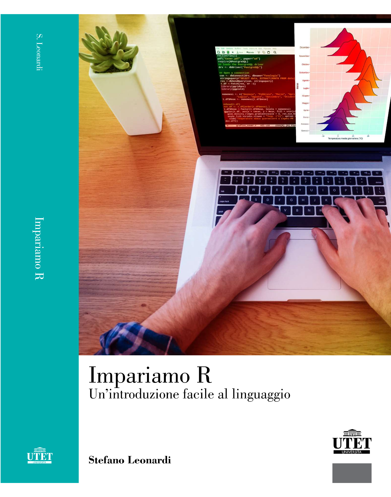

# Impariamo-R
Deposito di file ed informazioni relativi al  libro **Impariamo-R: un introduzione facile al linguaggio** di Stefano Leonardi

{ width=40% }

Se avete commenti, osservazioni, richieste o senalazioni riguardanti il libro scrivete a stefano.leonardi@gmail.com

I *file di dati* utilizzati nel libro sono scaricabili a questo [link](https://github.com/leonarste/Impariamo-R/blob/main/Dati-Impariamo-R.zip)

